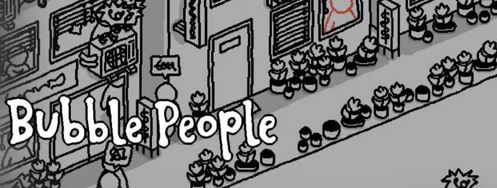
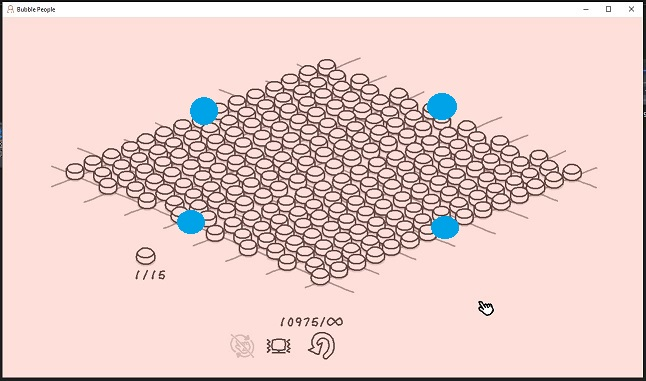
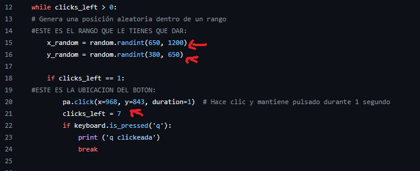

# Bubble-People-Achievement

#Sinceramente me relajo sacar logros de este juego, pero hay uno que no, que solo era molesto por que si, hablo del logro **STAY AWAY FROM THE SKINNER** 

¿de que va el logro? de pinchar 10.000 burbujas en el nivel libre, ¡son muchas horas! 

Así que hice un codigo en 2 partes, y aqui las intrucciones de uso.

1. Encontrar X e Y de limites del terreno clickeable (Puntos Celestes) y el boton de reinicio (usas el script reconocimiento.py)
2. Cargar esos datos en el script (automatizacion.py)
3. dejar el script trabajando solo. (automatizacion.py)
4. cuando alcanses el logro, manten presionada la letra "q" para salir del programa

### Muestra de donde hay que modificar valores en el codigo

### Librerias Necesarias 
-keyboard
-pyautogui as pa
-random
-time
